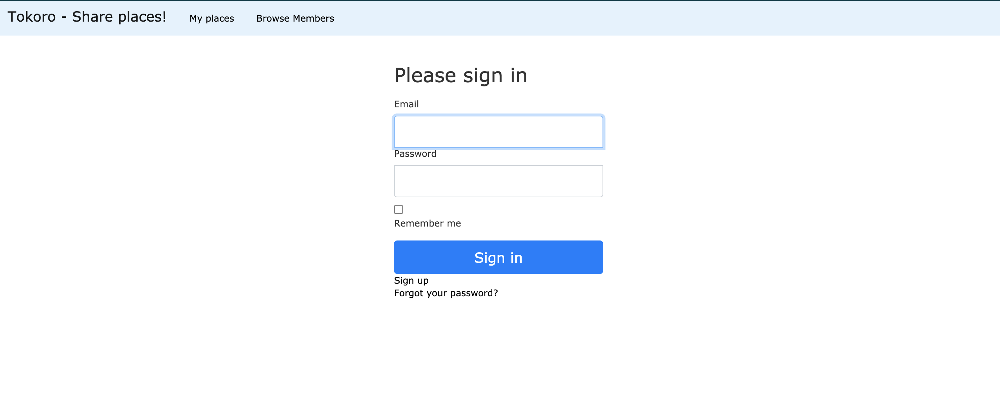
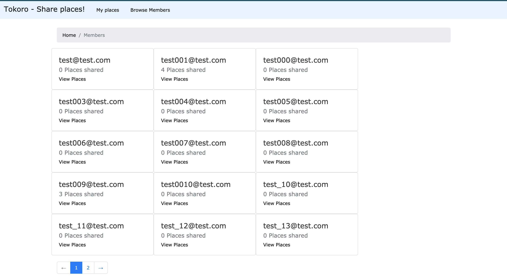
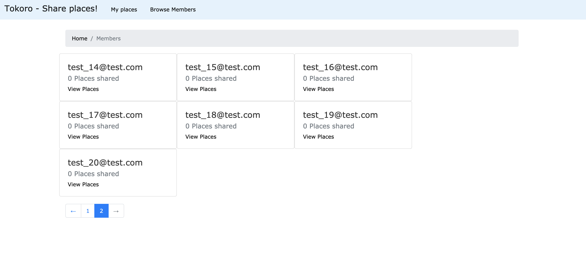
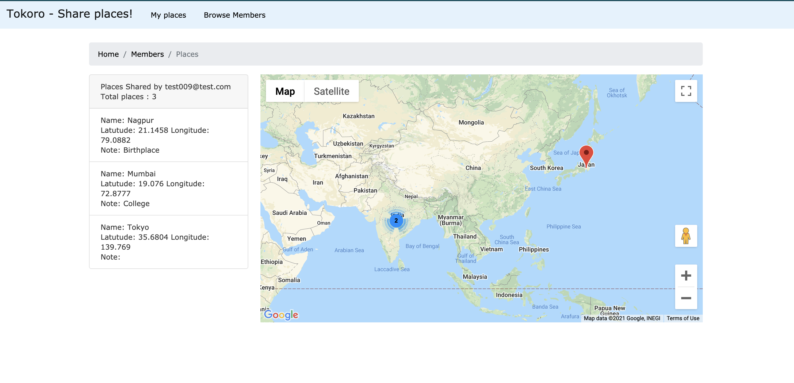
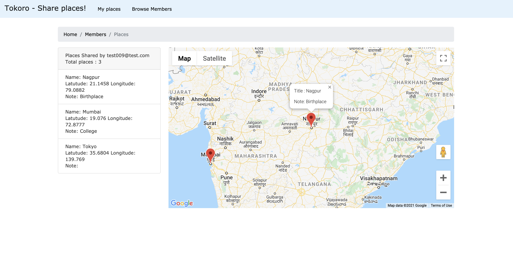
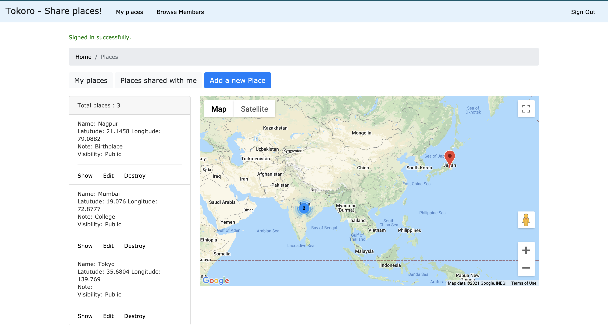
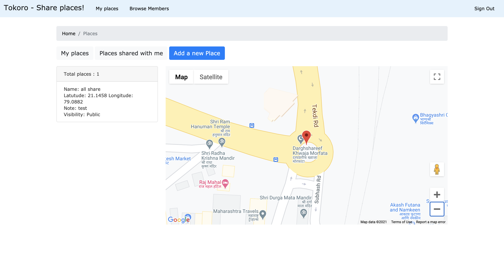
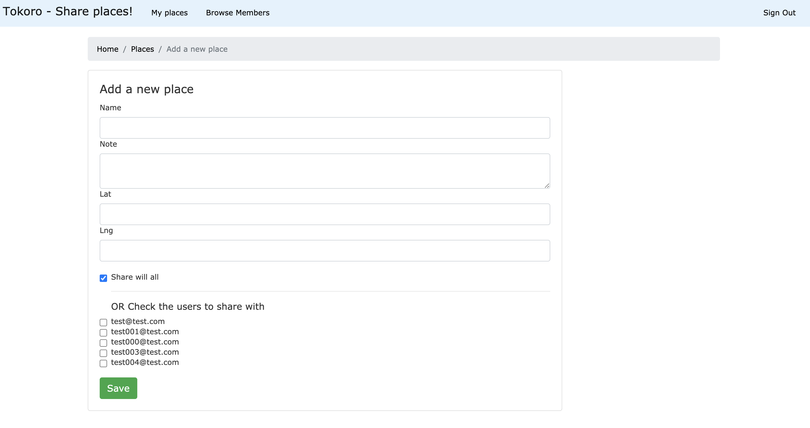
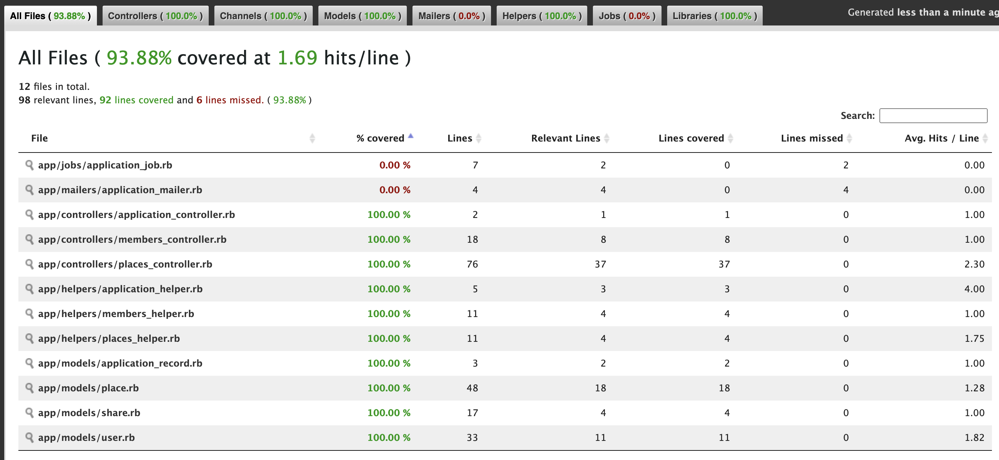

# [Tokoro]('https://japanesetactics.com/what-does-tokoro-mean-in-japanese-here-is-the-answer') is a collection of places!

## Heroku deploy
- https://polar-depths-22464.herokuapp.com
  
  Usernames: test001@test.com / test002@test.com  / test003@test.com 
  
  Password: test009
## Showcase
#### Login Page

#### Browse Users

#### Browse Users (Pagination)

#### Browse Places (Public)

#### Browse Places (With Marker info)

#### Browse own places

#### Browse places shared with me

#### Add a new place

# Local Setup

## Dependencies
- ruby 2.7.2p137
- Rails 6.1.1
- PG

## Seed entries
`bundle exec rails db:seed`

User 1
- email:test001@test.com pass:test009
- All public places

User 2 
- email:test002@test.com pass:test009
- Mix of public and private places

User 3
- email:test003@test.com pass:test009
- All private places

## Test
`bundle exec rspec`

Current code coverage 
